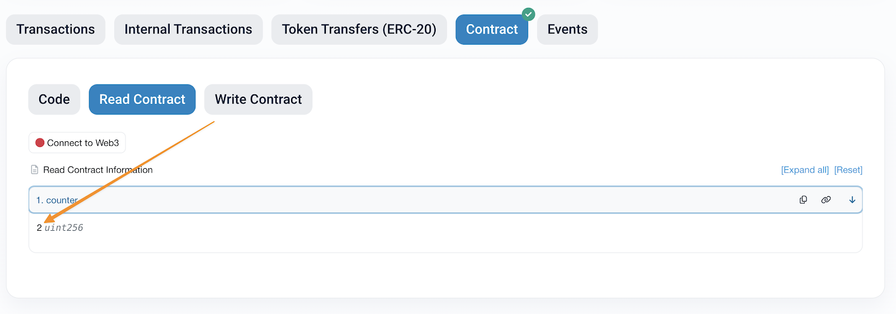

# ChainLink

# Introduction

-   [chainlink](https://chain.link)
-   [chainlink discourd](https://discord.com/invite/chainlink)
-   [Ethereum Stack Exchange](https://ethereum.stackexchange.com/)

## Major Chainlink Services

-   Chainlink Data and Price Feeds
-   Chainlink Automation
-   Chainlink CCIP
-   Chainlink Functions
-   Chainlink VRF
-   Chainlink Data Feeds
-   Chainlink Proof of Reserve

# Smart Contract and Solidity Fundammentals

## Solidity Programming: A Guide for Blockchain Enthusiasts

[Solidity](https://soliditylang.org) is a high-level, object-oriented programming language for writing smart contracts. It is a curly-bracket language similar to C++, Python, and JavaScript. Solidity is specifically built to run on the Ethereum Virtual Machine (EVM), making it the primary language for developing decentralized applications (dApps) and blockchain-based protocols.

Solidity provides features such as:

-   **Static typing**: Variable types must be defined in advance and are checked at compile time, reducing errors.
-   **Inheritance**: Contracts can inherit from other contracts, promoting code reuse and modularity.
-   **User-defined types**: You can create custom data structures using structs, mappings, and enums.
-   **Library support**: Reusable code modules can be imported to extend functionality.
-   **Smart contract interaction**: Contracts can easily communicate with other contracts on the blockchain.
-   **Low-level EVM access**: Advanced developers can use inline assembly for optimized performance.

### Solidity Code Structure

-   **License Identifier** : specify how others can use your code with an SPDX license identifier:
    ```solidity
    // SPDX-License-Identifier: MIT
    ```
-   **Version Pragma** : declare which version of Solidity your code is compatible with using that _pragma_ directive:
    ```solidity
    pragma solidity ^0.8.19;
    ```
-   **Contract Declaration** : The main code is contained within a contract declaration:
    ```solidity
    contract MyContract {
        // Contract code goes here
    }
    ```

### Programming Fundamentals for Solidity

#### Variables: Storing Information

Variables are named containers that hold data values. In Solidity, each variable must have a specific type that defines what kind of data it can store, and its location (storage, memory, or calldata) determines where the data is stored.

**State Variables** : These are permanently stored on the blockchain in storage:

```solidity
contract StorageExample {
    uint256 public myNumber = 42;    // A number
    string public myText = "Hello";  // Text
    bool public isActive = true;     // A true/false value
    address public owner;            // An Ethereum address
    uint256 private secretNumber;    // A private number
}
```

When you see a variable defined at the contract level like this, it's a state variable that will be stored on the blockchain permenantly. Sometimes, for clarity, we label variables as stored in storage using the s\_ prefix e.g. s_balance or s_owner.

State Variable Visibility :

-   **public**: Anyone can read this variable, and Solidity automatically creates a getter function.

    ```solidity
    uint256 public counter = 0; // Creates a counter() function that returns the value
    ```

-   **private**: Only accessible within the current contract (not truly private on the blockchain since they can be accessed via the contract storage).

    ```solidity
    uint256 private password = 123456; // Not accessible from other contracts
    ```

-   **internal**: Accessible within the current contract and contracts that inherit from it

    ```solidity
    uint256 internal sharedSecret = 42; // Visible to this contract and child contracts
    ```

The default visibility is _internal_ if not specified.

#### Constant and Immutable variables

Solidity provides two special types of state variables that can significantly reduce gas costs and improve security:

**Constant Variables**: Variables marked as constant must be assigned a value at declaration and cannot be changed afterwards:

```solidity
contract TokenContract {
    // Must be assigned at declaration
    uint256 public constant DECIMAL_PLACES = 18;
    string public constant TOKEN_NAME = "My Token";
    address public constant DEAD_ADDRESS = 0x000000000000000000000000000000000000dEaD;
}
```

Key characteristics of _constant_ variables:

-   Must be assigned a value when declared.
-   Value is set at compile time.
-   Cannot be changed after contract deployment.
-   Do not take up storage slots (saving gas).
-   Only value types and strings can be constants.
-   Usually, constant variables are capitalized.

**Immutable Variables**: Variables marked as immutable can be assigned only once, but this assignment can happen in the constructor:

```solidity
contract TokenContract {
    // Declared but not assigned yet
    address public immutable deployer;
    uint256 public immutable deploymentTime;

    constructor() {
        // Assigned once in the constructor
        deployer = msg.sender;
        deploymentTime = block.timestamp;
    }
}
```

Key characteristics of _immutable_ variables:

-   Can be assigned in the constructor or at declaration
-   Cannot be changed after construction
-   More gas efficient than regular state variables
-   Less gas efficient than constants
-   Only value types can be immutable (not strings or reference types)

When to Use Each

-   Use constant for values known at compile time (e.g., mathematical constants, configuration values)
-   Use immutable for values that depend on deployment conditions but won't change after that (e.g., deployer address, configuration based on constructor arguments)
-   Use regular state variables for values that need to change during the contract's lifetime

Use _constant_ and _immutable_ whenever possible to:

-   Reduces gas costs
-   Makes contract intentions clearer
-   Improves security by preventing accidental state changes

#### Data Types: Different Kinds of Information

Solidity has two main categories of data types: value types and reference types. Understanding this distinction is important for how data is stored and managed in your contracts.

**Value Types** : Value types store their data directly. When you assign a value type to another variable, you get a copy of the value.

```solidity
// Let's say we create a variable with a value:
uint a = 5;
​
// When we assign it to another variable:
uint b = a;
​
// Now b has its own copy of the value 5
​
// If we change b:
b = 10;
​
// The value of a still remains 5
// The value of b is now 10
```

This happens because value types (like integers, booleans, addresses, etc.) store their actual data directly in the variable. Each variable has its own separate copy of the data.

This differs from how some other types (called reference types) work, where instead of getting a new copy, you might just get directions pointing to the original data (like when someone gives you an address to a house rather than building you a new identical house). We will go through this shortly.

The Solidity value types include:

-   **uint (Unsigned Integer)**: Positive whole numbers (no decimals, no negatives)

    ```solidity
    uint256 public score = 100;
    ```

-   **int (Signed Integer)**: Whole numbers that can be negative (no decimals)

    ```solidity
    int256 public temperature = -5;
    ```

    The number after uint/int (like 256) represents how many bits are used to store the number. More bits mean larger possible values. The maximum value of e.g. a uint256 is 2^256-1 and a int256 2^255-1 since it has to be able to store the sign too.

-   **bool (Boolean)**: _true_ or _false_ values

    ```solidity
    bool public isComplete = false;
    ```

-   **address**: An Ethereum account (wallet) address

    ```solidity
    address public contractCreator = 0x123...;
    ```

-   **bytes (Fixed Size)**: Fixed-size byte arrays (bytes1 to bytes32)
    ```solidity
    bytes32 public dataHash = 0xabcd...;
    ```

**Reference Types** : Reference types, unlike value types don't store their data directly in the variable but instead store a **"pointer"** or reference to where the data is located. When you assign a reference type to another variable, both variables point to the same data. We will be going through pointers and what they are shortly. Think of reference types like having a TV remote control. The remote doesn't contain the actual TV shows, but it points to the TV where you can watch them.

The Solidity reference types include:

-   **string**: Text values (dynamic length bytes)

    ```solidity
    string public message = "Welcome!";
    ```

-   **arrays**: Ordered lists of items of the same type

    ```solidity
    uint256[] public scores = [85, 90, 95];
    ```

-   **mapping**: Key-value pairs (like a dictionary or lookup table)

    ```solidity
    mapping(address => uint256) public balances;
    // This creates a relationship where each address has an associated uint256 value.
    ```

-   **struct**: Custom groupings of related data.

    ```solidity
    struct Person {
        string name;
        uint256 age;
        address walletAddress;
    }
    ```

-   **bytes (Dynamic Size)**: Variable length byte array

    ```solidity
    bytes public dynamicData;
    ```

#### Understanding Pointers and Data Location

A **pointer** is a variable that stores the memory address/location for another piece of data rather than the data itself. Think of it as a signpost pointing to where the actual data lives rather than directly containing it.

In Solidity, reference types (arrays, structs, strings, and mappings) are stored as pointers. When you pass these types around, Solidity doesn't copy all the data; it just references where the data is stored.

This differs from value types (like uint, int, and bool), which directly store their data and create copies when assigned to new variables.

To explain, the concept of a pointer, here is a pseudocode example:

```solidity
// Conceptual example in Solidity-like pseudocode
​
// Declare and initialize an array in storage (blockchain permanent memory)
array storageArray = [1, 2, 3]; // original array in storage
​
// Create a pointer to the storage array
// This doesn't copy the data, it just creates a reference to the same storage location
array storagePointer = storageArray; // points to the same data
​
// Modify the array through the pointer
storagePointer[0] = 100; // changes the actual storage array
​
// At this point:
// storageArray is [100, 2, 3]  (it was changed!)
​
// Create a memory copy of the storage array
// This copies the entire array to a new location in temporary memory
array memoryCopy = copy of storageArray; // memoryCopy is [100, 2, 3]
​
// Modify the memory copy
memoryCopy[1] = 200; // only changes the copy, not the original
​
// Final result:
// storageArray is [100, 2, 3]  (unchanged by memory modifications)
// memoryCopy is [100, 200, 3]  (modified locally)
```

#### Storage Locations

Understanding how Solidity handles data storage is especially important when working with reference types. These keywords specify where data is stored:

-   **storage**: Permanent storage on the blockchain (expensive)

    -   Used for state variables.
    -   Data persists between function calls and transactions.
    -   Most expensive in terms of gas costs.

-   **memory**: Temporary storage during function execution (cheaper)

    -   Only exists during function execution.
    -   Cheaper than storage.
    -   Used for function parameters, return values, and local variables.

-   **calldata**: Read-only temporary storage for function parameters (most efficient)

    -   Similar to memory but read-only.
    -   Can't be modified.
    -   Most gas-efficient.
    -   Used primarily for external function parameters.

```solidity
// State variable - stored in storage
uint256[] permanentArray;
​
function processArray(uint256[] calldata inputValues) external {
    // 'inputValues' exists in calldata - can't be modified

    // Local variable in memory - temporary copy
    uint256[] memory tempArray = new uint256[](inputValues.length);
    for (uint i = 0; i < inputValues.length; i++) {
        tempArray[i] = inputValues[i] * 2;
    }

    // Reference to storage - changes will persist
    uint256[] storage myStorageArray = permanentArray;
    myStorageArray.push(tempArray[0]); // This updates the blockchain state
}
```

When working with reference types like strings, arrays, and structs:

-   Use calldata for external function parameters when possible (most efficient).
-   Use memory for function parameters that need to be updated.
-   Use storage when you need to modify state variables.

#### Functions: Making Things Happen

Functions are blocks of code that perform specific actions. They're how your contract actually does things:

```solidity
contract Counter {
    uint256 public count = 0;

    // This function increases the count by 1
    function increment() public {
        count = count + 1;  // You can also write: count += 1;
    }

    // This function decreases the count by 1
    function decrement() public {
        count = count - 1;  // You can also write: count -= 1;
    }
}
```

Function Parts:

-   **Name**: What you call the function (like increment).
-   **Parameters**: Input values the function needs .
-   **Visibility**: Who can call this function.
-   **Returns**: What output the function provides.
-   **Function Body**: The code inside the curly braces {}.

```solidity
function add(uint256 a, uint256 b) public pure returns (uint256) {
    return a + b;
}
```

this function:

-   Is named _add_.
-   Takes two parameters: _a_ and _b_, both of type _uint256_.
-   Is _public_ so anyone can call it.
-   Is _pure_ which means it doesn't read or modify state.
-   Returns a _uint256_ value.
-   Adds the two input values and returns the result.

Function Visibility

-   **public**: Anyone can call this function
-   **private**: Only this contract can call this function
-   **internal**: Only this contract and contracts that inherit from it can call this function-
-   **external**: Only calls from outside the contract are allowed (more efficient for certain use cases)

Special Function Types:

-   **view**: Can read but not modify state

    ```solidity
    function getCount() public view returns (uint256) {
        return count;
    }
    ```

-   **pure**: Cannot read or modify state

    ```solidity
    function addNumbers(uint256 a, uint256 b) public pure returns (uint256) {
        return a + b;
    }
    ```

-   **constructor**: Runs only once when the contract is deployed

    ```solidity
    constructor() {
        owner = msg.sender;  // Sets the contract creator as the owner
    }
    ```

-   **payable**: means that the function can be sent ether.

    ```solidity
    mapping(address => uint256) balances;
    ​
    function sendMeMoney() public payable {
        balances[user] += msg.value; // more on this "msg.value" coming in a second!
    }
    ```

#### Transaction Context and Global Variables

Solidity provides access to transaction information and blockchain data through special built-in variables. These are crucial for building secure and functional smart contracts.

-   **msg.sender**: The address that called the current function:

    -   A wallet address or another contract
    -   Commonly used for access control and tracking user activity

    ```solidity
    contract OwnerExample {
        address public owner;

        constructor() {
            owner = msg.sender; // The address that deploys the contract becomes the owner
        }
    }
    ```

-   **msg.value**: The amount of ETH (in wei) sent with the function call:

    -   Only available if the function is marked as payable
    -   Used to receive payments or deposits

    ```solidity
    contract PaymentExample {
        mapping(address => uint256) public payments;

        // Function that can receive ETH
        function makePayment() public payable {
            require(msg.value > 0, "Must send some ETH");
            payments[msg.sender] += msg.value;
        }

        // Function that checks if minimum payment was made
        function verifyMinimumPayment(uint256 minimumAmount) public view returns (bool) {
            return payments[msg.sender] >= minimumAmount;
        }
    }
    ```

-   **msg.data**: The complete calldata (input data) of the transaction:

    -   Contains the function signature and arguments
    -   Used in advanced use cases and proxies

    ```solidity
    contract DataExample {
        bytes public lastCallData;

        // Store the raw calldata of the latest transaction
        function recordCallData() public {
            lastCallData = msg.data;
        }

        // View the size of the calldata
        function getCallDataSize() public view returns (uint256) {
            return lastCallData.length;
        }
    }
    ```

#### Block Information Variables

-   **block.timestamp**: The current block's timestamp (seconds since Unix epoch):

    -   Can be used for time-based logic
    -   Don't rely on it for precise timing (miners have some flexibility)

    ```solidity
    contract TimestampExample {
        uint256 public contractCreationTime;

        constructor() {
            contractCreationTime = block.timestamp;
        }

        // Check if a specified duration has passed since contract creation
        function hasDurationPassed(uint256 durationInSeconds) public view returns (bool) {
            return (block.timestamp >= contractCreationTime + durationInSeconds);
        }

        // Create a simple time lock that releases after a specified date
        function isTimeLockExpired(uint256 releaseTime) public view returns (bool) {
            return block.timestamp >= releaseTime;
        }
    }
    ```

-   **block.number**: The current block number:

    -   Useful for counting blocks or implementing block-based logic

    ```solidity
    contract BlockNumberExample {
        uint256 public deploymentBlockNumber;

        constructor() {
            deploymentBlockNumber = block.number;
        }

        // Calculate how many blocks have been mined since deployment
        function getBlocksPassed() public view returns (uint256) {
            return block.number - deploymentBlockNumber;
        }

        // Check if enough blocks have passed for a specific action
        function hasReachedBlockThreshold(uint256 blockThreshold) public view returns (bool) {
            return getBlocksPassed() >= blockThreshold;
        }
    }
    ```

Combining Context Variables in a Contract:

```solidity
contract TimeLockedWallet {
    address public owner;
    uint256 public unlockTime;

    event Deposit(address indexed sender, uint256 amount, uint256 timestamp);
    event Withdrawal(uint256 amount, uint256 timestamp);

    constructor(uint256 _unlockDuration) {
        owner = msg.sender;
        unlockTime = block.timestamp + _unlockDuration;
    }

    // Accept deposits from anyone
    function deposit() public payable {
        require(msg.value > 0, "Must deposit some ETH");
        emit Deposit(msg.sender, msg.value, block.timestamp);
    }

    // Only allow the owner to withdraw after the unlock time
    function withdraw() public {
        require(msg.sender == owner, "You are not the owner");
        require(block.timestamp >= unlockTime, "Funds are still locked");
        require(address(this).balance > 0, "No funds to withdraw");

        uint256 balance = address(this).balance;
        payable(owner).transfer(balance);

        emit Withdrawal(balance, block.timestamp);
    }

    // Check if withdrawal is possible yet
    function withdrawalStatus() public view returns (bool canWithdraw, uint256 remainingTime) {
        if (block.timestamp >= unlockTime) {
            return (true, 0);
        } else {
            return (false, unlockTime - block.timestamp);
        }
    }
}
```

#### Control Structures: Making Decisions

-   **Conditionals (if/else)**: Conditionals let your code make decisions:

    ```solidity
    function checkValue(uint256 value) public pure returns (string memory) {
        if (value > 100) {
            return "Value is greater than 100";
        } else if (value == 100) {
            return "Value is exactly 100";
        } else {
            return "Value is less than 100";
        }
    }
    ```

-   **Loops**: Loops repeat code until a condition is met:

    ```solidity
    function sumArray(uint256[] memory numbers) public pure returns (uint256) {
    uint256 total = 0;

        for (uint i = 0; i < numbers.length; i++) {
            total += numbers[i];
        }

        return total;

    }
    ```

> Note:
>
> Be careful with loops in Solidity because each operation costs gas, and loops with too many iterations can exceed block gas limits. This is known as a denial of service (DoS).

#### Error Handling and Requirements

-   **Require Statements**: require checks a condition and reverts the transaction if it fails. The second parameter is an error message that helps users understand what went wrong.

    ```solidity
    function withdraw(uint256 amount) public {
        require(balances[msg.sender] >= amount, "Insufficient balance");
        balances[msg.sender] -= amount;
        payable(msg.sender).transfer(amount);
    }
    ```

-   **Custom Errors**: For gas efficiency, you can define custom errors. This is what you should do fpr errors, rather than using the _require_ keyword:

    ```solidity
    error InsufficientBalance(address user, uint256 balance, uint256 withdrawAmount);

    function withdraw(uint256 amount) public {
        if (balances[msg.sender] < amount) {
            revert InsufficientBalance(msg.sender, balances[msg.sender], amount);
        }
        balances[msg.sender] -= amount;
        payable(msg.sender).transfer(amount);
    }
    ```

#### Events: Communicating with the Outside World

Events in Solidity are like announcements that your contract makes when something important happens. Events should be emitted when the contract state is updated:

```solidity
contract Token {
    event Transfer(address indexed from, address indexed to, uint256 amount);

    mapping(address => uint256) public balances;

    function transfer(address to, uint256 amount) public {
        require(balances[msg.sender] >= amount, "Insufficient balance");

        balances[msg.sender] -= amount;
        balances[to] += amount;

        emit Transfer(msg.sender, to, amount);
    }
}
```

> Note:
>
> The indexed keyword makes it easier to search for specific events later.

#### Modifiers: Reusable Function Conditions

Modifiers are a way to create reusable logic for your functions:

```solidity
contract Owned {
    address public owner;

    constructor() {
        owner = msg.sender;
    }

    modifier onlyOwner() {
        require(msg.sender == owner, "Not the owner");
        _; // This placeholder is replaced with the function code
    }

    function setOwner(address newOwner) public onlyOwner {
        owner = newOwner;
    }
}
```

The _ in the modifier represents where the function code will be executed. For example, if the _ is before the modifier logic, the function will be executed before the modifier logic.

#### Interfaces

Interfaces in Solidity act as blueprints that define what functions a contract must implement without specifying how those functions work. Interfaces cannot contain function implementations, state variables, constructors, or inheritance from other contracts. They can only declare function signatures (name and input). When a contract implements an interface using the "is" keyword, it must include all the functions defined in that interface with matching signatures.

For example, imagine we have an interface called IPayable:

```solidity
interface IPayable {
    function pay(address recipient, uint256 amount) external returns (bool);
    function getBalance(address account) external view returns (uint256);
}
```

Any contract that implements this interface must include these exact functions:

```solidity
contract PaymentProcessor is IPayable {
    mapping(address => uint256) private balances;

    function pay(address recipient, uint256 amount) external override returns (bool) {
        require(balances[msg.sender] >= amount, "Insufficient balance");
        balances[msg.sender] -= amount;
        balances[recipient] += amount;
        return true;
    }

    function getBalance(address account) external view override returns (uint256) {
        return balances[account];
    }
}
```

This standardization makes interfaces particularly useful for interacting with unknown contracts—you only need to know what functions you can call, not how they're implemented, enabling different contracts to communicate consistently and predictably. It tells calling contracts what functions are available on another contract and how to call those functions.

### Programming Best Practices for Solidity

1. Keep it Simple: Complex code is harder to secure
2. Check conditions before changing state: Validate all inputs with require or custom errors
3. Use descriptive variable and function names: Make your code easy to understand
4. Comment your code: Explain why you're doing something, not just what
5. Follow naming conventions:
    - Contracts: PascalCase (like SimpleToken)
    - Functions/variables: camelCase (like balanceOf)
    - Private/internal state variables: prefix with \_ (like \_owner)
6. Be aware of gas costs: Every operation costs money in the form of gas

### What Is ABI (Application Binary Interface)?

The ABI is like a smart contract's instruction manual that tells applications exactly how to talk to your contract on the blockchain.

It describes, using structured data, exactly what functions and data types are available for use in the contract and how to “call” or use them.

#### Why do we need ABIs?

Imagine you have a smart contract deployed on Ethereum. Your contract might have functions like transfer, approve, or getBalance. But how does a website or another application know:

-   What functions exist in your contract?
-   What parameters each function needs?
-   What data types to expect in return?

This is where the ABI comes in! It bridges the gap between your human-readable smart contract code and the binary data that the blockchain understands.

#### Purpose of the ABI

The ABI serves as a standardized way to:

-   Call functions in a smart contract
-   Encode function arguments
-   Decode return data
-   Interact with contracts from outside the blockchain (like through web applications)

Think of the ABI as a contract's "API documentation" but in a machine-readable format.

#### ABI Format

The ABI is a JSON array that describes everything publically visible on a contract.

Let's take a simple example. Take a simple smart contract Simple Math that has one function add that adds two numbers together:

```solidity
// SPDX-License-Identifier: MIT
pragma solidity ^0.8.0;
​
contract SimpleMath {
    // Adds two numbers and returns the result
    function add(uint256 a, uint256 b) public pure returns (uint256) {
        return a + b;
    }
}
```

When you compile this contract, you will get the following ABI in JSON format:

```json
[
	{
		"inputs": [
			{ "internalType": "uint256", "name": "a", "type": "uint256" },
			{ "internalType": "uint256", "name": "b", "type": "uint256" }
		],
		"name": "add",
		"outputs": [{ "internalType": "uint256", "name": "", "type": "uint256" }],
		"stateMutability": "pure",
		"type": "function"
	}
]
```

The ABI tells you that there is a function named _add_ which takes two numbers (of type _uint256_) and returns a number.

#### Using ABI in Practice

When you deploy a contract, you'll need its ABI to interact with it later.

Frontend applications use the ABI to format calls to your contract correctly. The following JavaScript example demonstratess how you would use the ABI to interact with a smart contract (using the ethers.js library):

```js
// JavaScript example using ethers.js
const contract = new ethers.Contract(contractAddress, contractABI, provider); // You need to pass the ABI!
await contract.deposit(100); // Calls the deposit function
```

## Smart Contract Libraries and Inheritance

Libraries and Inheritance concepts allow you to reuse code and use external dependencies, making your contracts cleaner, more secure, and cheaper to deploy.

When to Use Each

| Feature     | Best For                         | Key Benefit                        | Limitation                                  |
| ----------- | -------------------------------- | ---------------------------------- | ------------------------------------------- |
| Libraries   | Utility functions and operations | Deploy once, use in many contracts | Cannot store state variables                |
| Inheritance | Extending existing contracts     | Build on top of established code   | Can create complexity with multiple parents |

### Smart Contract Libraries

Libraries are reusable pieces of code that you can share across multiple contracts. Think of them as toolboxes containing helpful functions that your contracts can use.

```solidity
// SPDX-License-Identifier: MIT
pragma solidity ^0.8.19;
​
library MathUtils {
    // Find the smaller of two numbers
    function min(uint256 a, uint256 b) internal pure returns (uint256) {
        return a < b ? a : b;
    }
​
    // Find the larger of two numbers
    function max(uint256 a, uint256 b) internal pure returns (uint256) {
        return a > b ? a : b;
    }
}
```

There are two ways to use library functions:

```solidity
// SPDX-License-Identifier: MIT
pragma solidity ^0.8.19;
​
import "./MathUtils.sol"; // Import the library
​
contract Calculator {
    // Attach library functions to uint256
    using MathUtils for uint256;
​
    // Method 1: Call as a library function
    function getMinimum(uint256 a, uint256 b) public pure returns (uint256) {
        return MathUtils.min(a, b);
    }
​
    // Method 2: Call as an attached function
    function getMaximum(uint256 a, uint256 b) public pure returns (uint256) {
        return a.max(b); // Same as MathUtils.max(a, b)
    }
}
```

#### Benefits of Libraries

-   Write Once, Use Everywhere: Define code in one place and use it in multiple contracts
-   Gas Savings: Libraries with internal functions get embedded in your contract's bytecode, while external library functions are deployed separately and can be reused by many contracts
-   No State Variables: Libraries cannot have state variables, making them perfect for pure utility functions

#### Types of Libraries

1. Embedded Libraries: Use internal functions that get copied into your contract's code
2. Linked Libraries: Use external and public functions. These functions don't get copied into your contract's bytecode - instead, your contract makes calls to the deployed library.

### Contract Inheritance

Inheritance lets one contract build upon another. Think of it like building with blocks—you start with a foundation and add more features.

```solidity
// SPDX-License-Identifier: MIT
pragma solidity ^0.8.19;
​
// Base contract with core functionality
contract BaseToken {
    string public name;
    uint256 public totalSupply;
​
    constructor(string memory _name) {
        name = _name;
        totalSupply = 1000000;
    }
​
    function getInfo() public virtual view returns (string memory) {
        return string.concat("Token: ", name);
    }
}
​
// Enhanced contract that inherits and extends BaseToken
contract GoldToken is BaseToken {
    constructor() BaseToken("Gold Token") {}
​
    // Add new functionality
    function getSymbol() public pure returns (string memory) {
        return "GLD";
    }
}
```

In this example, GoldToken inherits all features from BaseToken and adds a new function.

### Function Overriding

Sometimes, you want to modify behavior from a parent contract. This is where function overriding comes in.

To override a function:

1. Mark the parent function with virtual (meaning "can be changed")
2. Mark the child function with override (meaning "I'm changing this")

```solidity
// SPDX-License-Identifier: MIT
pragma solidity ^0.8.19;
​
contract BaseToken {
    // The virtual keyword allows this function to be overridden
    function getTokenName() public virtual pure returns (string memory) {
        return "BaseToken";
    }
}
​
contract CustomToken is BaseToken {
    // The override keyword shows we're replacing the parent's function
    function getTokenName() public override pure returns (string memory) {
        return "CustomToken";
    }
}
```

#### Using _super_ to Call Parent Functions

Sometimes, you want to extend a function rather than completely replace it:

```solidity
contract ExtendedToken is BaseToken {
    function getTokenName() public override pure returns (string memory) {
        // Call the parent function and add to it using the super keyword
        return string.concat(super.getTokenName(), " Plus");
        // Returns "BaseToken Plus"
    }
}
```

#### Multiple Inheritance

Solidity allows a contract to inherit from multiple parents, but this requires careful handling.

```solidity
contract Mintable {
    function canMint() public virtual pure returns (bool) {
        return true;
    }
}
​
contract Burnable {
    function canBurn() public virtual pure returns (bool) {
        return true;
    }
}
​
// Inherit from both contracts
contract Token is Mintable, Burnable {
    // This contract now has both canMint() and canBurn() functions
}
```

When multiple parents have functions with the same name, you must specify which ones you're overriding:

```solidity
contract BaseA {
    function getValue() public virtual pure returns (string memory) {
        return "A";
    }
}
​
contract BaseB {
    function getValue() public virtual pure returns (string memory) {
        return "B";
    }
}
​
// Multiple inheritance with function name conflict
contract Combined is BaseB, BaseA {
    // Must specify all contracts being overridden
    function getValue() public override(BaseB, BaseA) pure returns (string memory) {
        return "Combined";
    }
}
```

The order in which you list parent contracts is important:

```solidity
// BaseB comes first in the inheritance list
contract TokenX is BaseB, BaseA {
    function getValue() public override(BaseB, BaseA) pure returns (string memory) {
        // This calls BaseB's implementation first
        return super.getValue(); // Returns "B"
    }
}
​
// BaseA comes first in the inheritance list
contract TokenY is BaseA, BaseB {
    function getValue() public override(BaseA, BaseB) pure returns (string memory) {
        // This calls BaseA's implementation first
        return super.getValue(); // Returns "A"
    }
}
```

### Using OpenZeppelin Contracts

One of the most common uses of inheritance is extending standardized contracts from dependencies like [OpenZeppelin](https://www.openzeppelin.com/):

```solidity
// SPDX-License-Identifier: MIT
pragma solidity ^0.8.19;
​
import { ERC20 } from "@openzeppelin/contracts/token/ERC20/ERC20.sol";
​
// Create a custom token by inheriting from ERC20
contract MyToken is ERC20 {
    constructor() ERC20("My Token", "MTK") {
        // Mint 1 million tokens to the deployer
        _mint(msg.sender, 1000000 * 10**18);
    }
​
    // Add custom features
    function burn(uint256 amount) public {
        _burn(msg.sender, amount);
    }
}
```

Inheritance lets you customize standard behavior:

```solidity
contract FeeToken is ERC20 {
    address public feeCollector;
​
    constructor(address _feeCollector) ERC20("Fee Token", "FEE") {
        feeCollector = _feeCollector;
        _mint(msg.sender, 1000000 * 10**18);
    }
​
    // Override the transfer function to add a 1% fee
    function transfer(address to, uint256 amount) public override returns (bool) {
        uint256 fee = amount / 100; // 1% fee
        uint256 netAmount = amount - fee;
​
        // Send fee to collector
        super.transfer(feeCollector, fee);
​
        // Send remaining amount to recipient
        return super.transfer(to, netAmount);
    }
}
```

#### OpenZeppelin Contracts Wizard

The [OpenZeppelin Contract Wizard](https://wizard.openzeppelin.com/) is a helpful tool that generates customized smart contracts with just a few clicks. It's perfect for:

-   Creating token contracts (ERC20, ERC721, ERC1155)
-   Adding security features
-   Implementing access control
-   Setting up governance

The wizard generates production-ready code that you can customize further.

### You can import code from various sources:

```solidity
// Import from npm package
import "@openzeppelin/contracts/token/ERC20/ERC20.sol";
​
// Import specific contracts
import {ERC721, IERC721} from "@openzeppelin/contracts/token/ERC721/ERC721.sol";
​
// Import from local file
import "./MyContract.sol";
```

### Key Takeaways

-   Libraries are great for utility functions and can be used across many contracts.
-   Inheritance lets you build on existing contracts and extend their functionality
    -   Use _virtual_ in parent contracts and _override_ in child contracts when overriding functions
    -   The _super_ keyword lets you call parent implementations
    -   With multiple inheritance, the order of parent contracts matters
    -   OpenZeppelin provides battle-tested contracts you can extend

### Best Practices

-   Keep it Simple: Avoid deep inheritance chains that are hard to follow
-   Document Function Overrides: Clearly comment what you're changing and why
-   Be Careful with Multiple Inheritance: It can create unexpected behavior if not managed properly
-   Reuse Trusted Code: Whenever possible, build on well-audited contracts like those from OpenZeppelin

## Testnet Funds

We will use Chainlink's services in smart contracts. We will deploy and interact with these contracts on testnets. Usually, this will be Sepolia, but in some instances, we will also use Base Sepolia.

Let's walk through how to get some testnet LINK, how to add LINK to MetaMask and how to send your tokens to another address

### Adding LINK to Metamask

-   Head to the [Chainlink documentation](https://docs.chain.link/resources/link-token-contracts) and scroll down to the chain you want to use LINK on. E.g. [Sepolia Testnet](https://docs.chain.link/resources/link-token-contracts#sepolia-testnet)
-   Click the **Add to wallet** button to import the LINK token to NetaMask. Note that this will only add the token for that secific network. This will need to be repeated for all networks you intend to use LINK tokens.

    

-   Click Add token to add the token to your MetaMask

    

### Using a LINK faucet

To obtain testnet LINK, head to the [Chainlink Faucet](https://faucets.chain.link/) page. Here, you will find a list of all supported networks.

Click the Link button at the top right, select the network(s) you want to get LINK on and click \*\*Continue. "


-   Click **Get tokens** and click **Confirm** in MetaMask to sign the transaction.
-   Once the transaction has confirmed, you can see the **LINK** balance in your wallet.

    

    

### Adding a token to MetaMask

LINK was easy to add to MetaMask since Chainlink included that cheeky **Add to wallet** button. But how do we add other tokens, such as USDC to MetaMask?

-   Find the token address. For USDC, for example, we can head to the [Circle documentation](https://developers.circle.com/stablecoins/usdc-on-test-networks) to find the address of the USDC contract on different chains. Copy the address for the USDC token on the chain you are working on.

-   Open MetaMask and check you are on the same chain as the token address you just copied by clicking on the network button on the top left corner in MetMask

    

-   Click the **Tokens** tab, click the vertical three dots button, and then **Import tokens**

    

-   Enter the token contract address. MetaMask will automatically detect your token and its related information if it follows the ERC-20 standard.

-   Check the correct information (Address, Token Symbol, and Decimals).

    

-   Click **Next** to confirm the information. Click Import to import your token to MetaMask. This lets you view your balance and send tokens to others using the MetaMask UI.

### Sending tokens to another address

-   Click on the **Tokens** tab, then click the token you want to send (you need to have imported it already), e.g., the LINK token.

    

-   Click the Send button.

    

-   Paste the address you want to send the tokens to.

    

-   Enter the amount and then click Next

    

-   To sign the transaction, click Confirm. This transaction will now be sent and the tokens will be transferred to the address you specified.

    

## Introduction To Remix

[Remix](https://remix.ethereum.org/) is an online Integrated Development Environment (IDE) specifically designed for smart contract development. It provides an easy-to-use interface for writing, compiling, deploying, and debugging Solidity smart contracts. Remix is widely used because of its simplicity, built-in tools, and browser-based functionality, allowing you to get started quickly without installing additional software.

### Key Features of Remix:

-   File Explorer: Manage your contract files and projects.
-   Solidity compiler: Compile and check smart contracts for errors.
-   Deploy & run transactions: Deploy contracts to local or public EVM networks and interact with them.
-   Debugger: Step through transactions to debug execution.
-   Plugin System: Extend Remix’s functionality with additional tools.

### Navigating Remix

-   File Explorer (left panel): Manage your workspaces, create new files, and organize contracts.
-   Editor (center panel): Write and modify Solidity smart contracts.
-   Terminal (bottom panel): View logs, compilation messages, and transaction details.
-   Solidity Compiler (sidebar): Compile smart contracts with different Solidity versions.
-   Deploy & Run Transactions (sidebar): Deploy contracts to a blockchain and interact with them.


### Creating Workspaces, Folders, and Files

Remix allows you to create different workspaces to organize your projects. This allows you to keep related files grouped together. A bit like a GitHub repository or a project folder on your comoputer.

1. Create a new Workspace in Remix:

    - At the top of the **File Explorer** panel, click on the Workspaces actions button (the burger icon)
    - Select **Create blank** to create a new workspace.
    - Give a name for your workspace. In this example, we will use the name "CLF".
    - Hit **Ok**

    

2. Create a new folder:

    - Right-click in the file explorer sidebar and click New Folder
    - Name the folder _contracts_

3. Create a new file:

    - Right-click on the contr_acts folder and click New file
    - Name the file _MyERC20.sol_

    

4. Write the code in your new file!

### Compiling Smart Contracts

Before deploying a smart contract, you must compile it to check for errors and generate the necessary bytecode.

1. Open the Solidity Compiler panel in Remix.
2. Select the correct Solidity version (matching your contract).
3. Ensure your contract file is still open in the main window and click **Compile** [YourContract.sol].
4. If there are errors, they will appear in the terminal.

 

5. You can also compile by hitting _Cmd + S_ on your Mac keyboard or _Ctrl + S_ on Windows.

    - If there are no errors, the contract will compile successfully, and you’ll see a green checkmark.

6. When we compile our contract, the compiler generates the ABI! To get the ABI of a contract (e.g., for verification or a front-end application) scroll down in the Solidity Compiler tab and blick the ABI button:

 

### Connecting to MetaMask

To deploy a contract on a real blockchain (e.g., Ethereum Mainnet, Sepolia, or Polygon), you need to connect Remix to MetaMask.

1. Open MetaMask and make sure you are on the desired network.
2. Go to the Deploy & Run Transactions panel in Remix.
3. Select Injected Provider - MetaMask as the environment.
4. MetaMask will prompt you to connect your wallet and approve the connection.


### Deploying Smart Contracts

Once compiled, a smart contract can be deployed on a local blockchain (e.g., Remix VM) or a real network (e.g., Ethereum).

1. Open the Deploy & Run Transactions panel.
2. Select a deployment environment (e.g., Remix VM for testing or Injected Provider - MetaMask for live networks).

 

3. Choose the correct contract from the dropdown.
4. Click Deploy and confirm the transaction in MetaMask to deploy your contract.

 

### Pinning Deployed Smart Contracts

After deployment, Remix allows you to pin a deployed contract to your workspace so you can continue interacting with it even after refreshing the page. Click the pin icon to pin the deployed contract.


### The contract address

1. In the **Deploy & Run Transactions** panel, find the deployed contract under Deployed Contracts.
2. Click the **copy icon** to save the contract address.
3. If needed, use the **At Address** button to reattach the contract after a page refresh.

### Interacting with Smart Contracts

Once deployed, you can interact directly with your smart contract from Remix.

1. Find the deployed contract in the Deploy & Run Transactions panel.
2. Click the dropdown to see available functions.
3. Enter any required parameters and click the transact button.
4. Confirm transactions in MetaMask (for state-changing functions).
5. View results in the Remix terminal.


## Writing an ERC20 Token Contract

[ERC-20](https://eips.ethereum.org/EIPS/eip-20) is a technical standard for fungible tokens on the Ethereum blockchain. "ERC" stands for "Ethereum Request for Comment," the naming convention for Ethereum improvement proposals. The "20" refers to the proposal number that created this standard. An ERC-20 token is a cryptocurrency that follows specific rules defined in this standard, including functions for transferring tokens, checking balances, and approving spending by third parties. These standardized functions ensure that ERC-20 tokens work consistently across the Ethereum ecosystem, allowing them to be easily exchanged, stored in wallets, and traded on decentralized exchanges. Popular examples include USDT (Tether), USDC, DAI, and many other cryptocurrencies that operate on Ethereum.

### Writing a Simple ERC20 Token

1.  Create a new Workspace in Remix:

    -   At the top of the File Explorer panel, click on the Workspaces actions button (the burger icon)
    -   Select Create blank to create a new workspace.
    -   Give a name for your workspace. In this example, we will use the name "CLF".
    -   Hit Ok

    

2.  Create a new folder:

    -   Name the folder contracts
    -   Right-click in the file explorer sidebar and click New Folder

3.  Create a new file:

    -   Right-click on the contracts folder and click New file
    -   Name the file MyERC20.sol

    

4.  Write the code!

    -   Copy and Paste the following token contract code: You could also create your token using the Openzeppelin Wizard.

        ```solidity
        // SPDX-License-Identifier: MIT
        pragma solidity ^0.8.26;

        import { ERC20 } from "@openzeppelin/contracts@5.2.0/token/ERC20/ERC20.sol";

        contract MyERC20 is ERC20 {
            constructor() ERC20("My Cyfrin CLF Token", "CLF") {}

            function mint(address to, uint256 amount) public {
                _mint(to, amount);
            }
        }
        ```

    -   Here, we have inherited the _ERC20_ smart contract from OpenZeppelin by importing it and then inheriting it using the is keyword.

    -   Then, in the _MyERC20_ constructor, we have invoked the parent _ERC20_ constructor:

        ```solidity
        constructor() ERC20("My Cyfrin CLF Token", "CLF") {}
        ```

    -   Finally, we created a way to create a supply of tokens by adding a public _mint_ function:

        ```solidity
        function mint(address to, uint256 amount) public {
            _mint(to, amount);
        }
        ```

### Adding Access Control

We can add access control to smart contracts using **modifiers**. We also can use dependencies, including OpenZeppelin.

We have written a simple token smart contract called _MyERC20_. This contract can create new tokens via the _mint_ function. However, currently, anyone can call this function and mint tokens (for free!). Let's change this.

Let's add the ability to give roles to certain addresses to give them permission to mint tokens.

### Adding Access Control Using OpenZeppelin

To add access control to our ERC-20 token contract, we will use OpenZeppelin's AccessControl smart contract. We need to import this contract and then inherit from it.

Then, we can use the state variables, functions, and modifiers declared inside the AccessControl smart contract from within our ERC-20 contract.

OpenZeppelin's AccessControl smart contract provides the ability to create [Roles](https://docs.openzeppelin.com/contracts/2.x/api/access#Roles).

-   Each new role created needs a role identifier used to grant, revoke, and check if an account has a role.
-   We will create a single role that enables the addresses with this role to mint tokens.
-   This _role identifier_ is a _bytes32 constant_ variable. By convention, this is usually a hashed string of the role name (with the string in capitals since this is a constant):

    ```solidity
    bytes32 public constant MINTER_ROLE = keccak256("MINTER_ROLE");
    ```

-   This role identitifier can now be passed to the functions in `AccessControl` to grant roles with the `AccessControl::grantRole` function, check whether an address has a role with the `AccessControl::hasRole` function, and revoke a role using the `AccessControl::revokeRole` function by passing in the role identifier e.g. `MINTER_ROLE` and the required address to grant/check/revoke the role for.

### Adding a Minter Role to a Token Contract

1.  Inherit the AccessControl contract:

    ```solidity
    // SPDX-License-Identifier: MIT
    pragma solidity ^0.8.19;

    import { ERC20 } from "@openzeppelin/contracts@4.6.0/token/ERC20/ERC20.sol";
    import { AccessControl } from "@openzeppelin/contracts@4.6.0/access/AccessControl.sol";

    contract MyERC20 is ERC20, AccessControl {
        constructor() ERC20("My Cyfrin CLF Token", "CLF") {}

        function mint(address to, uint256 amount) public {
        _mint(to, amount);
        }
    }
    ```

2.  Create a bytes32 constant state variable containing the hashed name of the role–the role identifier:

    ```solidity
    // SPDX-License-Identifier: MIT
    pragma solidity ^0.8.19;

    import { ERC20 } from "@openzeppelin/contracts@4.6.0/token/ERC20/ERC20.sol";
    import { AccessControl } from "@openzeppelin/contracts@4.6.0/access/AccessControl.sol";

    contract MyERC20 is ERC20, AccessControl {
        bytes32 public constant MINTER_ROLE = keccak256("MINTER_ROLE");

        constructor() ERC20("My Cyfrin CLF Token", "CLF") {}

        function mint(address to, uint256 amount) public {
            _mint(to, amount);
        }
    }
    ```

3.  Now, we can add the onlyRole modifier from the AccessControl contract to our mint function (since our token contract is inheriting this contract) to add a check that the msg.sender has the role that we pass to the modifier.

    ```solidity
    // SPDX-License-Identifier: MIT
    pragma solidity ^0.8.19;

    import { ERC20 } from "@openzeppelin/contracts@4.6.0/token/ERC20/ERC20.sol";
    import { AccessControl } from "@openzeppelin/contracts@4.6.0/access/AccessControl.sol";

    contract MyERC20 is ERC20, AccessControl {
        bytes32 public constant MINTER_ROLE = keccak256("MINTER_ROLE");

        constructor() ERC20("My Cyfrin CLF Token", "CLF") {}

        function mint(address to, uint256 amount) public onlyRole(MINTER_ROLE) {
            _mint(to, amount);
        }
    }
    ```

Only addresses with the `MINTER_ROLE` can call the mint function.

However, we do not have a way to give addresses this `MINTER_ROLE`. To do this, we need another role that can grant roles to other addresses. OpenZeppelin's `AccessControl` contract has a role that does this already, called the `DEFAULT_ADMIN` role.

Let's grant this role to the deployer in the constructor. When an address deploys a smart contract, it automatically calls the constructor. Therefore, the deployer is the msg.sender in the context of the constructor.

Let's grant them the `DEFAULT_ADMIN` role and while we are at it, also the `MINTER_ROLE` so they can mint tokens. We can do this by calling the `_grantRole` function, which takes the role and the address to grant the role to:

```solidity
// SPDX-License-Identifier: MIT
pragma solidity ^0.8.19;
​
import { ERC20 } from "@openzeppelin/contracts@4.6.0/token/ERC20/ERC20.sol";
import { AccessControl } from "@openzeppelin/contracts@4.6.0/access/AccessControl.sol";
​
contract MyERC20 is ERC20, AccessControl {
   bytes32 public constant MINTER_ROLE = keccak256("MINTER_ROLE");
​
    constructor() ERC20("My Cyfrin CLF Token", "CLF") {}
​
    function mint(address to, uint256 amount) public onlyRole(MINTER_ROLE) {
        _mint(to, amount);
    }
}
```

## Deploying an ERC-20 Contract

Now we have written our permissioned ERC-20 token contract, let's deploy it to a live testnet and then add that token to our MetaMask so we can see our balance and use the UI to perform token transfers.

### Compile & Deploy

1.  Compile your smart contract

    -   Make sure you still have the `MyERC20.sol` file open.
    -   Head to the **Solidity compiler** tab on the left sidebar.
    -   Select the compiler version. Here, we are using version `0.8.19`. Ensure the compiler version is set to `0.8.19` or later, as indicated in the pragma directive (`pragma solidity ^0.8.19`;). The `^` symbol tells the compiler that any version above `0.8.19` can be used. Without the symbol, only version `0.8.19` would be allowed.
    -   Hit **Compile MyERC20.sol** to compile the contract

        

    -   You can also compile by hitting `Cmd + S` on your keyboard on Mac or `Ctrl + S` on windows.
    -   If there are no errors, the contract will compile successfully, and you’ll see a green checkmark.

2.  Deploy your smart contract

    -   Head to the **Deploy and run transactions** tab in the left-hand sidebar.
    -   We want to deploy our contract with MetaMask. To connect your wallet to Remix, click **Select Environment** dropdown menu and select **Injected Provider - MetaMask**.
    -   This will open MetaMask and ask to connect to Remix. Click Connect.

        

    -   In the Contract dropdown, select MYERC20.sol.

        

    -   Click **Deploy**.

    -   Sign the transaction in Metamask to deploy your smart contract!

You will know if your contract has been successfully deployed if:

-   The Remix terminal window (the block at the bottom of your screen) shows a green tick next to the transaction information:

    

-   Your MetaMask shows a successful contract deployment transaction:

    

-   And your contract is in the Deployed contracts section on Remix:

    

> Note: We are going to be using this ERC-20 contract we deployed in the next section so double check you have pinned the contract so you can use it again later. It may also be worth copying the address and keeping a note of it somewhere.


### Check Total Token Supply and Balances

1.  Once your contract is deployed, you can view it in the Deployed Contracts section. Here, you will find all the functions available within the contract, allowing you to interact with them directly.

2.  You can pin your contract by clicking on the pin icon. This will save your contracts if you want to close Remix and continue another time. Note that pinning is workspace-specific, so make sure you open the same Remix workspace when you need to access this token contract.

    

3.  To check the total supply of your token, call the totalSupply function.

    If you want to view the balance of a specific wallet, use the balanceOf function and pass the wallet address as a parameter. Currently, your token will not have any tokens minted, so the return value will be 0 for both function calls.

    

### Adding Your Token to MetaMask

If you deployed your contract on a testnet, you can add your token to MetaMask by following these steps:

1. Copy the token contract address. In Remix, you can find this address in the Deployed Contracts section.
   

2. Open your MetaMask wallet and click on the Tokens Tab. Hit the three vertical dots icon on the right hand side and click Import tokens.
   

3. Enter the token contract address. MetaMask will automatically detect your token and its related information since it follows the ERC-20 standard.
4. Check if the information is correct (Address, Token Symbol, and Decimals).
   

5. Click Next to confirm the information. Click Import to import your token to MetaMask. This allows you to view your balance and send tokens to others using the MetaMask UI.

## Interacting with a Contract - Minting Tokens

We have not yet minted any tokens, which means currently the total available supply of our token is `0` - no tokens currently exist! To increase the supply of tokens, we have to call the function `mint` from our contract:

-   Go to the **Deploy & Run Transactions** tab.
-   Find your token and expand the tab to see the contract's functions.

    

-   Find the function `mint` and expand it to check the parameters.

    -   `to`: The address receiving the minted tokens. We will create `100` tokens by setting the amount value as `100000000000000000000`. This is because our Token has `18` decimals.
    -   amount: The amount to mint.

        

-   To send the transaction, click on the transact button and confirm the transaction in your Metamask wallet.
-   Now, you can check to see if your balance has increased by calling balanceOf and passing the address you minted the tokens to.
-   You can also check your balance in MetaMask by heading to the Tokens tab since we added our token in the previous lesson.

### Allowance and Token Approvals

Token approvals enable another address to spend another address's tokens. This feature is commonly used in DeFi applications that need to transfer ERC20 tokens from your wallet to another wallet or contract via another intermediary smart contract.

To use this feature, you can call the `approve` function, specifying the address that will spend your tokens and the amount they are allowed to spend.


You can always verify if a contract has permission to spend your tokens by calling the allowance function.


## Building An ERC-721 (NFT) Token

The [Open Zeppelin Contracts Wizard](https://wizard.openzeppelin.com/) is an interactive smart contract generator based on OpenZeppelin Contracts.

In this exercise, we will create a simple [ERC-721](https://eips.ethereum.org/EIPS/eip-721) NFT contract.

When you first open the wizard, you will see an interface with options for the type of contract you want to create, including ERC-20, ERC-721, ERC-1155, Governor, and Custom.

We will be selecting the ERC-721 option as this is the token standard for NFTs.

On the left side, you’ll notice the Settings tab. This is where we can configure various features for our NFT. We will be setting the following:

-   Name
-   Symbol
-   Mintable
-   Auto-increment Ids


You will notice that the code is automatically filled out for you as you click various options. This makes it very quick and easy to generate templates for these contracts.

In the upcoming Chainlink VRF Section, you will learn how to take this knowledge and utilize Chainlink VRF to add randomness to an NFT, creating a lot more fun for your users!


# Oracle & ChainLink DataFeed

## Oracles Concepts

Blockchains are designed to be self-contained and deterministic systems. Deterministic means that given the same inputs, the system will always produce the same outputs. This property is crucial for security and consensus, as all blockchain nodes must agree on the state of the data for every transaction.

However, due to their isolated nature, blockchains cannot directly access external (off-chain) data. While this design enhances security and data permanence, it also introduces significant trade-offs:

Blockchains process transactions with higher latency than traditional computing systems due to their need for global consensus.

Smart contracts have limited functionality because they cannot independently fetch real-world data (e.g., financial market prices, weather conditions, IoT sensor readings).

This fundamental limitation is known as the Oracle Problem. Blockchain applications struggle to achieve full real-world applicability without a reliable way to connect with external data sources.


### What is a Blockchain Oracle?

A blockchain oracle is an infrastructure component that enables secure data exchange between blockchains and external systems. Decentralized oracles provide a trust-minimizing mechanism for bringing off-chain data onto the blockchain and allow smart contracts to be executed based on real-world events or off-chain computation.

By solving the Oracle Problem, oracles can expand the capabilities of smart contracts, making them more dynamic and useful across industries like decentralized finance (DeFi) and gaming.

They perform several critical functions:

1. **Listening**: Detecting when a smart contract on a blockchain is requesting external data.
2. **Fetching**: Retrieving data from off-chain sources (e.g., APIs, web servers, IoT devices).
3. **Formatting**: Converting the data into a blockchain-compatible format.
4. **Securing & Validating**: Ensuring data integrity through cryptographic verification mechanisms.
5. **Computing**: Performing off-chain computations to enhance scalability, efficiency, and security.
6. **Broadcasting**: Sending the verified data back to the blockchain. Since all nodes need to agree on the data, it is referred to as “broadcasting.”
7. **Delivery**: Delivering computation results to external systems as needed or from external systems back into smart contracts.

### Types of Blockchain Oracles

1. **Inbound Oracles**: These oracles bring external data to the blockchain. For example, they deliver information such as weather conditions, sports scores, or stock prices into a smart contract.
2. **Outbound Oracles**: These oracles send data from the blockchain to external systems. They enable smart contracts to communicate and interact with off-chain systems.
3. **Consensus Oracles**: These oracles aggregate data from multiple sources and provide a single source of truth to the smart contract. This is done to improve the reliability and accuracy of the data.
4. **Cross-Chain Oracles**: These oracles facilitate communication and data exchange between different blockchain networks (each of which is like an isolated “island”). Cross-chain oracles are essential for interoperability between different blockchains.

### Centralized vs. Decentralized Oracles

Centralized Oracles:

-   Operate through a single entity or node.
-   Risks: Single point of failure, vulnerability to attacks, and data manipulation.
-   If that central oracle node is compromised or stops, the blockchain can no longer access reliable external data.

Decentralized Oracles:

-   Use multiple independent nodes to fetch and validate data, reducing risks of manipulation and downtime.
-   Enhance security, transparency, and reliability by distributing trust among multiple parties to create a trust-minimized system.


### When to Use Oracles

-   **Data Exchange**: Smart contracts can integrate external data sources, such as financial market feeds, insurance claim data, and gaming results.
-   **Automation**: smart contracts can automate processes that depend on external data, on-chain conditions, or certain time intervals. This is useful, for example, for triggering payments or executing trades based on market prices. These automation oracles can also remove the need for dependence on humans or centralized entities to trigger the operation of a smart contract when specific conditions are met.
-   **Cross-Chain Communication**: Smart contracts can interact with other blockchain networks, allowing for more complex and interoperable decentralized applications (dApps).
-   **Verifiable Randomness**: Blockchains are deterministic by design, meaning the same input will always produce the same output. This makes generating true randomness impossible on-chain. Oracles provide cryptographically verified random numbers that cannot be manipulated by miners, which is crucial for fair NFT distributions, gaming applications, and random selection processes.

## Chainlink Oracles Overview

Chainlink is a **decentralized oracle network (DON)** that provides smart contracts with off-chain and cross-chain data and computations in a reliable, secure, and decentralized manner. It was created to solve the “oracle problem,” which refers to the challenge of getting off-chain data into a blockchain in a secure, trust-minimized, scalable, and decentralized manner

Chainlink does this using a similar model to a blockchain–there is a decentralized network of independent operators (oracle nodes) that retrieve data from multiple sources. This data is then aggregated, and a single aggregated data point is delivered on-chain.


Chainlink has become the most widely used DON because it addresses the key challenges of connecting blockchains to external information:

1. **The Trust Problem**

    - Challenge: How can a blockchain trust information from the outside world?
    - Chainlink's Solution: Instead of relying on a single source of information, Chainlink uses a network of independent operators (called nodes) that each collects data. These nodes compare their findings and reach consensus on the correct answer. These nodes work together to form the Chainlink Decentralized Oracle Network, referred to as the DON.
    - Analogy: Rather than trusting a single weather reporter, imagine getting weather reports from 10 different meteorologists and going with what the majority says.

2. **The Accuracy Problem**

    - Challenge: How can we ensure the data is accurate?
    - Chainlink's Solution: Chainlink carefully selects data sources, verifies the reputation of nodes, and uses cryptographic signatures to prove who provided what information.
    - Analogy: Like checking a journalist's sources and past reporting history before trusting their news story.

3. **The Reliability Problem**
    - Challenge: What happens if a data source goes down?
    - Chainlink's Solution: By using multiple independent nodes and data sources, Chainlink ensures the system keeps running even if some participants fail.
    - Analogy: If you're waiting for an important package, the postal service doesn't rely on a single delivery person—if someone calls in sick, another carrier covers their route.

### How Chainlink Works

1. **Request**: A smart contract asks for specific information (like the current price of gold or a verifiably random number), computation, or cross-chain communication.
2. **Assignment**: Chainlink selects a group of trusted nodes to fulfill this request.
3. **Data Collection**: Each node independently gathers the requested information from reliable sources.
4. **Consensus**: The nodes compare their answers and agree on the correct value.
5. **Delivery**: The verified information is delivered back to the smart contract.
6. **Payment**: The nodes receive LINK tokens (Chainlink's cryptocurrency) as payment for their service.

### Chainlink Services

1. **Data and Price Feeds**

    - What they do: Provide data on-chain, such as price information for cryptocurrencies, commodities, foreign exchange rates, etc.
    - How they work: Networks of nodes collect price data from multiple exchanges and data providers, then aggregate them to determine the most accurate price at a certain time interval or when certain conditions are met.
    - Real-world use: When you use a DeFi platform that needs to know the current ETH/USD price, it's likely using Chainlink Price Feeds.

2. **Automation (formerly Keepers)**

    - What it does: Allows smart contracts to be automatically triggered when certain conditions are met.
    - How it works: Chainlink nodes monitor conditions and execute functions when predefined criteria are satisfied.
    - Real-world use: Automatically liquidating collateral in lending platforms when values drop below required thresholds.

3. **Cross-Chain Interoperability Protocol (CCIP)**

    - What it does: Enables secure communication between different blockchains.
    - How it works: Creates a way for smart contracts on one blockchain to send messages and tokens to another blockchain in a secure and decentralized way.
    - Real-world use: Send tokens from Ethereum to Polygon or have a smart contract on one chain trigger an action on another chain.

4. **Chainlink Functions**

    - What it does: Allows developers to run custom computations off-chain and bring the results onto the blockchain.
    - How it works: Executes custom code in a secure environment and delivers verified results to smart contracts.
    - Real-world use: Complex calculations that would be too expensive to run directly on the blockchain.

5. **Verifiable Random Function (VRF)**

    - What it does: Generates provably fair and verifiable random numbers that cannot be manipulated or predicted.
    - How it works: Uses cryptographic techniques to create random numbers that come with proof they were generated fairly.
    - Real-world use: NFT projects use VRF to fairly distribute random traits or select winners for giveaways.

6. **Data Streams**

    - What it does: Provide on-demand access to high-frequency, low-latency market data, delivered off-chain and verifiable on-chain.
    - How it works: Data streams use a pull-based design that supports sub-second data resolution for latency-sensitive use cases by retrieving data only when needed.
    - Real-world use: High-frequency price updates for apps like predictions markets that enable participants to react quickly to events and provide accurate settlements.

7. **Proof of Reserve**

    - hat it does: Verifies that tokenized assets (like stablecoins) are actually backed by real-world reserves.
    - ow it works: Regularly checks and confirms that the claimed backing assets exist in the reported amounts.
    - eal-world use: Stablecoin issuers can prove they have the money backing their tokens.

8. **DeFi (Decentralized Finance)**

    - Price Feeds: Most major lending and trading platforms use Chainlink to get accurate price information for cryptocurrencies and other assets.
    - Example: When you take out a crypto loan on Aave or trade on Uniswap, Chainlink price feeds help determine fair values and prevent exploitation.

9. **Gaming**

    - Verifiable Randomness: Chainlink provides unpredictable, tamper-proof random numbers for fair gameplay and NFT distribution.
    - Example: When a game needs to randomly select a winner or distribute random traits to NFT characters, Chainlink ensures no one can manipulate the outcome.

### The LINK Token: Fueling the Network

The LINK token is Chainlink's cryptocurrency that serves several important functions:

**Payment**: Chainlink node operators receive LINK tokens as payment for providing data services.

**Security Deposit**: Nodes often need to stake LINK tokens as collateral, giving them skin in the game to be honest.

## Chainlink Data Feeds

Chainlink Data Feeds allow you to fetch real-world data such as asset prices, reserve balances, and L2 sequencer health and use that data in your smart contract.

Data feeds provide many different types of data for your applications:

-   [**Price Feeds**](https://docs.chain.link/data-feeds#price-feeds): aggregated source crypto-asset prices.
-   [**SmartData Feeds**](https://docs.chain.link/data-feeds#smartdata-feeds): a suite of onchain data offerings designed to unlock the utility, accessibility, and reliability of tokenized real-world assets (RWAs)
-   [**Rate and Volatility Feeds**](https://docs.chain.link/data-feeds#rate-and-volatility-feeds): data for interest rates, interest rate curves, and asset volatility.
-   [**L2 Sequencer Uptime Feeds**](https://docs.chain.link/data-feeds#l2-sequencer-uptime-feeds): Identify if an L2 sequencer is available.

some reference resources on Data feeds:

[**Using Data Feeds | Chainlink Documentation**](https://docs.chain.link/data-feeds/getting-started)

[**Developer Hub | Data**](https://dev.chain.link/products/data)

### Data Feed Components

-   **Consumer**: A consumer is an on-chain or off-chain contract that uses (i.e., consumes) Chainlink services (e.g., Data Feeds). For Data Feeds specifically, on-chain Consumer smart contracts use Chainlink’s [**AggregatorV3Interface**](https://github.com/smartcontractkit/chainlink/blob/develop/contracts/src/v0.8/shared/interfaces/AggregatorV3Interface.sol) to interact with the Chainlink Data Feed on-chain contracts and retrieve information from the smart contract that’s aggregating the relevant data. The Consumer contract is the smart contract that you design and implement to use Chainlink services. For a complete list of functions exposed in the AggregatorV3Interface, see the [**Data Feeds API Reference**](https://docs.chain.link/data-feeds/api-reference).

-   **Proxy Contract**: Proxy contracts “point” to the correct aggregator contract that received data for a particular Data Feed. Using proxies enables the underlying aggregator to be upgraded without any service interruption to consuming contracts. The proxy will point to the new contract, and nothing changes for the consuming contract. The [**EACAggregatorProxy.sol**](https://github.com/smartcontractkit/chainlink/blob/contracts-v1.0.0/contracts/src/v0.6/EACAggregatorProxy.sol) contract on GitHub is a common example.

-   **Aggregator Contract**: An aggregator is a smart contract managed by Chainlink that receives periodic data updates from the Chainlink decentralized oracle network. Aggregators store aggregated data on-chain so consumers can retrieve it and act upon it within the same transaction. They also make the data transparent and publicly verifiable. For a complete list of functions and variables available on most aggregator contracts, see the [**Data Feeds API Reference**](https://docs.chain.link/data-feeds/api-reference).

## Chainlink Price Feeds

Chainlink Price Feeds are a specific type of decentralized data feed provided by the Chainlink network, designed to deliver reliable, tamper-proof price data for assets such as cryptocurrencies, commodities, and other financial instruments.

Price Feeds empower smart contracts to act on important, real-time data such as asset prices and market data. This is especially true in [DeFi](https://www.cyfrin.io/glossary/decentralized-finance-defi) applications, where accurate and timely pricing information is critical to providing a trust-minimized and efficient alternative to traditional finance.

### Common Use Cases

-   **DeFi Protocols**: Chainlink Price Feeds are used by various DeFi platforms like Aave and Compound to determine real-time asset prices for lending, borrowing, trading, and other financial services. For example, the lending and borrowing platform [AAVE](https://aave.com/) uses Data Feeds to help ensure loans are issued at fair market prices and that loans are sufficiently collateralized at all times.
-   **Stablecoins**: Price Feeds help maintain stablecoins' peg by providing accurate market values of assets used to “back” the stablecoin.
-   **Derivatives and Prediction Markets**: Chainlink Price Feeds are used to settle derivatives contracts and provide real-time market data for prediction markets. You will learn more about these later.


You must know the feed’s on-chain address to get information from a Data Feed.

[Full list of Chainlink Data Feeds Contract Addresses](https://docs.chain.link/docs/reference-contracts)

## Build a Token Shop with Price Feeds

In this lesson, we'll build a "TokenShop" smart contract that enables users to purchase tokens. It will use the ETH/USD price feed to calculate how many tokens to issue to a purchaser, based on the amount of ETH they pay.

Our shop will leverage Chainlink Data Feeds to establish accurate token pricing in USD.

1. When users send ETH to the contract, it will:
2. Query the current ETH/USD exchange rate.
3. Calculate the USD value of the sent ETH.
4. Determine the appropriate amount of tokens to mint based on our fixed USD token price.
5. Mint and transfer the calculated tokens directly to the buyer.

The `TokenShop` contract will integrate with our custom ERC-20 token contract.

### Writing the TokenShop smart contract

#### Imports

In order to call functions on the price feed and MyERC20, we need the following imports:

```solidity
import { AggregatorV3Interface } from "@chainlink/contracts/src/v0.8/interfaces/AggregatorV3Interface.sol";
import { Ownable } from "@openzeppelin/contracts@4.6.0/access/Ownable.sol";
import { MyERC20 } from "./MyERC20.sol";
```

#### Ownable

We need our contract to have an owner. To do this, we will inherit a smart contract from OpenZeppelin that sets the address passed tp the Ownable constructor to an `internal` state variable called `_owner`. This `owner` address is accessible using the external owner function. Let's import and inherit the contract and then invoke the constructor:

```solidity
// SPDX-License-Identifier: MIT
pragma solidity ^0.8.26;
​
import { Ownable } from "@openzeppelin/contracts@5.2.0/access/Ownable.sol";
​
contract TokenShop is Ownable {
    constructor() Ownable(msg.sender) {} // we have set the contract owner to be the contract deployer (msg.sender)
}
```

Here, we have set the `msg.sender` to be the contract owner. This will be the address deploying the contract since the constructor is invoked by the deployer automatically when the contract is deployed.

This allows us to use the `onlyOwner` modifier from the `Owner` contract to prevent anyone but the contract owner from calling functions with this modifier.

#### State variables and the constructor

In the constructor, we will set two immutable variables:

-   `i_priceFeed`: The ETH/USD price feed contract must follow the `AggregatorV3Interface`; therefore, we cast the feed address to the required contract type.
-   `i_token`: The `MyERC20` contract needs to follow `MyERC20`, so we cast it to that contract type.

We also define the following constant state variables:

-   `TOKEN_DECIMALS`: The number of decimals for the `MyERC20` token (which we set before as 18 decimals)
-   `TOKEN_USD_PRICE`: The price of a token in USD.

We also define some events and errors we will be using in the contract.

```solidity
AggregatorV3Interface internal immutable i*priceFeed;
MyERC20 public immutable i_token;
​
uint256 public constant TOKEN_DECIMALS = 18;
uint256 public constant TOKEN_USD_PRICE = 2 * 10 ** TOKEN_DECIMALS; // 2 USD with 18 decimals
​
event BalanceWithdrawn();
​
error TokenShop**ZeroETHSent();
error TokenShop**CouldNotWithdraw();
​
constructor(address tokenAddress) Ownable(msg.sender) {
    i_token = MyERC20(tokenAddress);
    /**
        * Network: Sepolia
        * Aggregator: ETH/USD
        * Address: 0x694AA1769357215DE4FAC081bf1f309aDC325306
    */
    i_priceFeed = AggregatorV3Interface(0x694AA1769357215DE4FAC081bf1f309aDC325306);
}
```

#### Receive function

We need to give users a way to send the contract ETH and `receive` tokens from the `MyERC20` contract. To do this, we use a `receive` function.

`receive` functions are special functions in Solidity that are automatically executed when someone sends ETH directly to the contract address without specifying any function to call. They don't take any arguments and don't return any values.

When a user sends ETH to our contract, the `receive` function will capture that ETH, calculate how many tokens they should get based on the current exchange rate, and then mint those tokens to the sender's address. This creates a simple way for users to swap their ETH for our custom token without needing to call a specific function - they can send ETH directly to the contract address using a standard transaction.

```solidity
receive() external payable {
    // convert the ETH amount to a token amount to mint
    if (msg.value == 0) {
        revert TokenShop__ZeroETHSent();
    }
    // convert the ETH sent to the contract to a token amount to mint and then mint the tokens
    i_token.mint(msg.sender, amountToMint(msg.value));
}
```

We have also added a check that the user hasn't called the contract and sent `0 ETH`. If they have, we have reverted with a custom error.

> Note:
>
> we must give the `TokenShop` contract permissions to call `MyERC20::mint`.

#### amountToMint function

In the `receive` function, we called a function called `amountToMint`, which we need to define. This function gets the ETH/USD price so that we can convert the amount of ETH sent to the contract to a USD amount. Then, we calculate the amount of tokens this USD amount corresponds to:

```solidity
function amountToMint(uint256 amountInETH) public view returns (uint256) {
    // Sent amountETH, convert to USD amount
    uint256 ethUsd = uint256(getChainlinkDataFeedLatestAnswer()) _ 10 \*\* 10; // ETH/USD price with 8 decimal places -> 18 decimals
    uint256 ethAmountInUSD = amountInETH _ ethUsd / 10 ** 18; // ETH = 18 decimals
    return (ethAmountInUSD \* 10 ** TOKEN_DECIMALS) / TOKEN_USD_PRICE; // \* 10 \*\* TOKEN_DECIMALS since tokenAmount needs to be in TOKEN_DECIMALS
}
```

#### Implementing chainlink data feeds

We now need to implement `getChainlinkDataFeedLatestAnswer` to get the ETH/USD price conversion:

```solidity
/**
    * Returns the latest answer
*/
function getChainlinkDataFeedLatestAnswer() public view returns (int) {
    (
    /*uint80 roundID*/,
    int price,
    /*uint startedAt*/,
    /*uint timeStamp*/,
    /*uint80 answeredInRound\*/
    ) = i_priceFeed.latestRoundData();
    return price;
}
```

Here, we have called the `latestRountData` function on the specific price feed address we set in the `constructor`. Since we only need the `price`, the other return values have been commented out.

#### Withdraw

Finally, let's create a way for the owner of the smart contract to withdraw the ETH in the contract using a low-level `call`:

```solidity
function withdraw() external onlyOwner {
    // low level calls can be done on payable addresses
    (bool success, ) = payable(owner()).call{value: address(this).balance}("");
    if (!success) {
        revert TokenShop\_\_CouldNotWithdraw();
    }
    emit BalanceWithdrawn();
}
```

### Deploying the TokenShop contract

1.  Go to the Deploy & Run Transactions tab within Remix.
2.  Select the `TokenShop.sol` contract from the contract field in the deployment tab.
3.  Make sure that your MetaMask browser wallet is connected to Sepolia and that you’ve connected to MetaMask as your Remix environment (the injected provider).
4.  The TokenShop contract requires a `tokenAddress` as a constructor parameter. So, paste the `MyERC20.sol` contract address you deployed in the previous section.

    

5.  Click on Deploy, and this will open MetaMask. Hit Confirm to sign the transaction on Sepolia. This will deploy the `TokenShop` contract to Sepolia testnet.

    After it’s deployed to Sepolia, you will see the transaction details in Remix’s console sub-window.

6.  Copy your `TokenShop` contract address from the Deployed Contracts section in Remix.
7.  It’s a good idea to “pin” the `TokenShop` contract in this workspace so you can still access it if you end up closing Remix and returning later.

    Ideally, at this point, both your `MyERC20` and `TokenShop` contracts should be pinned to your active Remix Workspace.

    

### TokenShop Access Control

Now let's give your `TokenShop` contract the ability to “mint” your tokens from the `MyERC20` contract! We need to give the `TokenShop` contract the `MINTER_ROLE`.

1.  In the Deployed contracts section, find your `MyERC20` contract dropdown. Look for the `MINTER_ROLE` function. Since it is a public state variable, it will have an automatic getter function to "get" it's value.

    

2.  Click it to read the data from your smart contract. Its value is `“0x9f2df0fed2c77648de5860a4cc508cd0818c85b8b8a1ab4ceeef8d981c8956a6”`. This is the [keccak256](https://www.cyfrin.io/glossary/keccak256) hash string representing the word “MINTER_ROLE”.

3.  Next, expand the `grantRole` function using the down arrow and paste that `MINTER_ROLE` hash `0x9f2df0fed2c77648de5860a4cc508cd0818c85b8b8a1ab4ceeef8d981c8956a6` into the `grantRole` function along with the address of the `TokenShop` contract you just deployed:

    

4.  Click `transact` to call the function and then sign the transaction in the MetaMask pop-up by clicking Confirm.

    Doing this will authorize your `TokenShop` to mint your newly created token.

    Before we continue, let’s double-check and confirm that your `TokenShop` has indeed been authorized.

### Check roles

1.  In your `Token` contract dropdown menu, find the `hasRole` function.
2.  Expand the function and note that it requires two parameters:

    -   `role`: We are interested in the `MINTER_ROLE`, which as a bytes32 value is `0x9f2df0fed2c77648de5860a4cc508cd0818c85b8b8a1ab4ceeef8d981c8956a6`. This is the `keccak256` hash of the string `"MINTER_ROLE"`. We will refer to those bytes as the hash from now.
    -   `account`: This function will tell us what role a given `account` has—in our case, the account we are checking the role for the `TokenShop` contract address.

    The function will return a boolean (`true` or `false`) indicating whether that address has that particular role assigned to it.

3.  Put in those two inputs and click on the `hasRole` button. It should return a boolean response of true.

    

### Getting Price Data From Chainlink Price Feeds

We will now use the Chainlink USD/ETH Price Feed that we referenced inside our TokenShop contract.

-   Go to your TokenShop contract dropdown and find the getChainlinkDataFeedLatestAnswer function. You can hover your mouse over the buttons to see the full function name.

-   Click on the transact to call that function and send a transaction. It will return the price with 8 decimal places.

    

This is the price of `1 ETH` in terms of `USD` using 8 decimal precision. Note that different feeds may have different precisions.

You can find the decimals for the different feeds in the [Price Feeds Documentation](https://docs.chain.link/data-feeds/price-feeds/addresses?network=ethereum&page=1#sepolia-testnet) (make sure “Show More Details” is checked).

To convert the integer (with a certain level of precision) to a float, we need to divide the result by 10, raised to the power of the number of decimal points (`8` in this case).

Since the ETH/USD price feed’s data has `8` decimal places, we can see that the price, as per the screenshot, is $1917.96 (divide the returned value by `10^8`).

## Buying Tokens from TokenShop

Let's use the TokenShop contract to buy some `MyERC20` tokens.

1.  Open your Metamask and click the Send button. Enter the TokenShop contract address as the To address and enter 0.001 as the amount to send 0.001 ETH to your TokenShop address.

    

    Click Continue and the Confirm to send the transaction.

    This will send 0.001 ETH to your TokenShop contract and trigger the receive function, which will mint tokens from the MyERC20 contract to your wallet address.

2.  Once MetaMask confirms the transaction on the blockchain, you can check whether your minted tokens show in your account in two ways:

    You can check your MetaMask wallet, under Tokens, to see if the Token you’ve previously added to your MetaMask has an updated balance.

    

    You can also click on the MyERC20 contract in Remix. Then, check how much of your token is held by your wallet address by calling balanceOf function and passing in your address.

    

# Chainlink Automation

## Introduction to Automation

Chainlink Automation is a decentralized service that automatically executes smart contract functions based on predefined conditions or at specific intervals.

### Why do we need Automation?

Smart contracts are powerful but have a fundamental limitation: they cannot trigger their own functions. They need external stimuli to execute their code, which is where Chainlink Automation comes in.

Think of your smart contract as a sophisticated machine. It can perform various tasks but needs someone to press its buttons to activate these functions. Manually monitoring conditions and triggering functions is an inefficient and unreliable way to ensure the machine is doing things in a timely manner.

Chainlink Automation solves this by acting as a vigilant operator for your smart contracts. It constantly monitors for specific conditions or timeframes you've defined. When these triggers are met, Chainlink Automation automatically executes the designated functions in your contract. It operates 24/7, with reliability and precision that manual monitoring cannot achieve.

### The Concept of an “Upkeep”

In Chainlink Automation, an `"upkeep"` refers to a registered job that the network will monitor and execute on-chain when appropriate.

When you register an upkeep, you're essentially telling the Automation network: "Watch for these specific conditions, and when they occur, call this function in my contract."

These specific conditions are called `"triggers"`.

### Types of Automation triggers

Chainlink Automation supports three distinct trigger mechanisms:

-   **Time-based triggers**: <br />
    These execute functions in your smart contract according to a schedule defined by a cron expression. For example, you could set a function to run every day at midnight or once per week.

-   **Custom logic triggers**: <br />
    These use custom logic defined within your smart contract through the AutomationCompatibleInterface. Your contract implements a checkUpkeep function that returns whether conditions are right for execution.

-   **Log trigger**: <br />
    These monitor blockchain events (logs) emitted by smart contracts. Chainlink Automation executes the associated function when a specified event occurs, allowing for event-driven automation.

### Automation Architecture

The Chainlink Automation Network consists of specialized Automation nodes coordinated by the Automation Registry smart contract. This Registry manages upkeep registrations and compensates nodes for successful executions.

Developers can register upkeeps, while node operators can register as Automation nodes. The network operates using a peer-to-peer system based on Chainlink’s [OCR3 protocol](https://docs.chain.link/architecture-overview/off-chain-reporting).

-   Automation nodes continuously scan for upkeeps that are eligible for execution.
-   Nodes reach consensus on which upkeeps to perform.
-   They generate cryptographically signed reports.
-   The Registry validates these reports before executing the upkeep functions.


This architecture provides several key benefits:

-   Cryptographic guarantees of execution.
-   Built-in redundancy across multiple nodes.
-   Resistance to network congestion with sophisticated gas management.
-   Reliable performance even during gas price spikes or blockchain reorganizations.

The system includes internal monitoring and alerting mechanisms to maintain network health and ensure high reliability and performance.

Chainlink Automation supports multiple blockchains, with details on the [supported networks page](https://docs.chain.link/chainlink-automation/overview/supported-networks). Information about the cost of using Chainlink Automation can be found on the [Automation economics page](https://docs.chain.link/chainlink-automation/overview/automation-economics).

## Time-Based Automation

Time-based automation enables you to automate any function in an existing smart contract that is externally callable. For this exercise, we will deploy a contract on Ethereum Sepolia. The contract will be a basic counter contract with one function: `count`. We will then use Automation to call `count` every 5 minutes.

### Prerequisites

-   [Testnet Sepolia funds](https://faucets.chain.link/)
-   [Testnet LINK on Sepolia](https://faucets.chain.link/)

### Creating a Counter Contract

1.  Open [Remix](http://remix.ethereum.org/) and create a new workspace by clicking the burger icon and then Create blank workspace. Name the workspace "Automation" and click **Ok**: <br />
    

2.  Create a folder called `contracts` by clicking the **Create folder** button: <br />
    

3.  Open the `contracts` folder by clicking on it and then create a file called `TimeBased.sol` by clicking on the **Create file** button: <br />
    

4.  Paste the following code from the [course code repo](https://github.com/ciaranightingale/chainlink-fundamentals-code/blob/main/automation/TimeBased.sol) into the `TimeBased.sol` file.

This simple smart contract stores a `counter` state variable (initially with the default value of `0`) that is incremented when `count` is called.

> Tip: <br > > `counter ++` is equivalent to writing `counter = counter + 1`. It's a fun little Solidity shortcut

### Deloying the TimeBased contract

Let's deploy this contract to Sepolia.

-   Head to the **Solidity compiler** tab and click **Compile TimeBased.sol** to compile your contract. <br />
    

-   Head to the **Deploy & run** transactions tab and select **Injected Provider - MetaMask** for the **Environment** to connect MetaMask to Remix. <br />
    

-   Open MetaMask and check you are still connected to Sepolia by clicking the top left-hand network selector button.

-   Click **Deploy** to deploy the `TimeBased` contract. This will trigger **MetaMask** to pop up. Click **Confirm** to sign the transaction to deploy the contract. <br />
    

You will know if your contract has been successfully deployed if:

-   The Remix terminal window (the block at the bottom of your screen) shows a green tick next to the transaction information: <br />
    

-   Your MetaMask shows a successful contract deployment transaction: <br />
    

-   And your contract is in the **Deployed contracts** section: <br />
    

-   Click the pin icon to the workspace to pin the `TimeBased` smart contract. This will ensure that the contract instance persists in your workspace when Remix is reloaded.

-   Finally, copy the `TimeBased` contract address by clicking the copy button next to the pin.

> Note: <br />
> From this point forward, I will assume you are comfortable with the following actions in Remix:

-   Creating new workspaces, folders, and files.
-   Compiling smart contracts.
-   Connecting MetaMask to Remix.
-   Deploying smart contracts.
-   Pinning smart contracts to a workspace.

This is to avoid repetition.

### Verify the smart contract

Verification allows block explorers and other services, such as Chainlink Automation, to access the contract's ABI and, therefore, its functions. In order for Automation to be able to call `count`, we need to first verify our smart contract.

Let’s verify our contract on [Etherscan](https://sepolia.etherscan.io/).

1.  Head to the [Etherscan website](https://sepolia.etherscan.io/).

2.  Search for the `TimeBased` contract address, then head to the Contract tab and click **Verify and Publish**. <br />
    

3.  Fill in the values for your contract. The compiler version can be found on the Solidity compiler tab in Remix. Click **Continue**. <br />
    

4.  On the next screen, paste in the code for the contract and leave the rest of the options default/blank. Click **Verify and Publish**.

    When you return to the contract on Etherscan, you should now see a green checkmark next to the Contract tab. Now, you can view the source code on Etherscan and easily interact with the contract from the Read contract and Write contract tabs.

    

### Creating a Time-Based Automation

Now that we’ve deployed and verified our smart contract let’s create the automation to enable automatic counting.

-   Head to the Chainlink [**Automation app**](https://automation.chain.link/)
-   Click **Register new Upkeep** and then **Connect wallet** to connect MetaMask to the Automation app.
-   Check that you’re connected to Sepolia by clicking the network dropdown in the app's top-right corner.
-   For the trigger mechanism, select **Time-based trigger** and click **Next**. <br />
    

-   Enter the `TimeBased` contract address and click **Next**. Our contract has been verified in this example, meaning Chainlink Automation can fetch the ABI. If you have a contract that has yet to be verified, you can provide the ABI. <br />
    

-   For the Target function, select the `count` function; this is the function we want Automation to execute, and click **Next**.

-   Now, we must decide when we want the function to run. In this example, we’ll have it run every five minutes or as a **Cron** expression: `_/5 _ \* \* \*`

Cron schedules are based on five values: minute, hour, day of the month, and day of the week.

Each field is represented by a number (or a special character):

Time (in UTC):

1. Minute: `0 - 59`
2. Hour: `0 - 23` (0 = midnight)
3. Day of month: `1 - 31`
4. Month: `1 - 12` (or names, like `Jan`, `Feb`)
5. Day of week: `0 - 6 `(0 = Sunday, or names like `Sun`, `Mon`)

Special characters:

-   `*` means “every” (every minute, every hour, etc.)
-   `,` lets you list multiple values (e.g., 1,3,5)
-   `-` specifies a range (e.g., 1-5)
-   `/` allows you to specify step values (e.g., \*/5 for “every 5 units”)

Examples:

-   `30 2 * * *`: Run at 2:30 AM every day
-   `0 */2 * * *`: Run every 2 hours
-   `0 9-17 * * 1-5`: Run every hour from 9 AM to 5 PM, Monday to Friday
-   `*/15 * * * *`: Run every 15 minutes
-   `0 0 1,15 * *`: Run at midnight on the 1st and 15th of each month
-   Select your **Cron expression**, `*/5 * * * *`, and click **Next**.
-   Fill in the **Upkeep details**:

    -   **Upkeep name**: A name for the upkeep visible on the Automation dashboard, e.g. **"TimeBased Counter"**
    -   **Admin Address**: This will be your connected wallet by default, but you can change which address will be the admin for the upkeep here.
    -   **Gas limit**: The maximum amount of gas your selected function for upkeep will need to perform. This is `500_000` by default.
    -   **Starting balance**: A starting balance of LINK is used to pay for Chainlink Automation. In this example, `5` LINK will be sufficient.
    -   The **Project information** is optional; we will leave it blank. <br />
        

-   Click **Register Upkeep** and approve the transactions to deploy the **CRON** job contract, request time-based upkeep registration, receive registration confirmation, and finally sign the message. <br />
    

-   Once this is complete, you should see that your registration request was successful, and you can then view your upkeep.

The **upkeep page** provides a quick overview of the upkeep status, such as when it was last run, the current balance of LINK, and how much LINK has been spent.


The **details section** will give you all the information about the upkeep, including when it will run next and what function it will call.


The **history section** shows the history of the upkeep. It is a useful tool for verifying whether an upkeep has been completed. Once five minutes have passed, you should be able to refresh the page and see that the upkeep has been completed.


If you head back to Etherscan, you can see the value of `counter` has increased. The upkeep will continue until it either runs out of LINK or the upkeep is paused.



> Note: <br />
> You can pause your automation from the Automation app UI or withdraw your LINK funds from it if you want it to stop running. You can always resume it later if necessary or create a new one for future projects.

